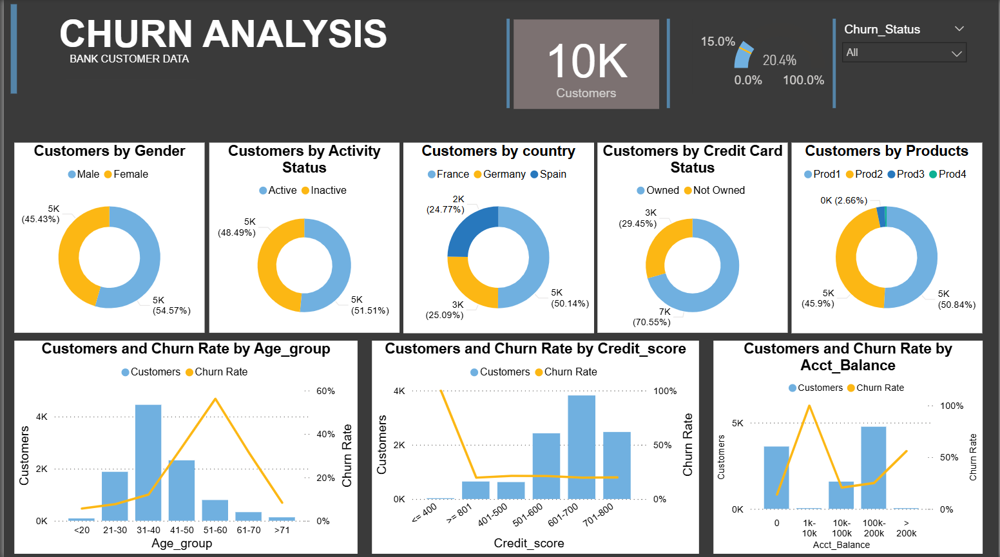

# 📊 Churn Analysis Dashboard

**Bank Customer Data | Power BI Project**

---

## Project Overview

The **Churn Analysis Dashboard** is an interactive Power BI project designed to analyze customer attrition using **10,000 bank customer records**. It helps identify the demographic, behavioral, and financial factors influencing churn, enabling data-driven customer retention strategies.

---

## KPIs Being Used

| KPI | Description |
|------|-------------|
| **Total Customers** | Total number of customers in the dataset (10,000). |
| **Churn Rate** | Percentage of customers who have left the bank. |
| **Churned Customers** | Total customers classified as churned. |
| **Retained Customers** | Total customers who remain with the bank. |
| **Retention Rate** | Percentage of customers successfully retained. |

---

## Description

This dashboard provides a comprehensive analysis of customer churn across multiple business dimensions, including **gender, activity status, country, credit card ownership, product usage, age group, credit score, and account balance**. Interactive visuals allow users to identify high-risk customer segments and uncover the primary drivers of customer attrition.

---

## Dashboard Components

- **KPI Cards**
  - Total Customers
  - Churn Rate
  - Churned Customers
  - Retention Rate

- **Donut Charts**
  - Customers by Gender
  - Activity Status
  - Country
  - Credit Card Status
  - Products

- **Combo Charts**
  - Customers & Churn Rate by Age Group
  - Customers & Churn Rate by Credit Score
  - Customers & Churn Rate by Account Balance

- **Interactive Slicer**
  - Churn Status (All, Churned, Retained)

---

## Dashboard Features

- Interactive filtering with slicers
- Dynamic KPI monitoring
- Multi-dimensional customer segmentation
- Churn trend analysis across demographic and financial attributes
- Business-friendly dark theme design
- Data-driven insights for retention strategy

---

## Tools & Technologies

| Tool | Purpose |
|------|---------|
| **Power BI Desktop** | Dashboard development & visualization |
| **Power Query** | Data cleaning & transformation |
| **DAX** | KPI measures & calculated columns |
| **Microsoft Excel** | Source data preparation |
| **SQL** | Data extraction & analytical queries |

---

## Key Business Insights

- The overall customer base consists of **10,000 customers**.
- Churn performance is monitored through dynamic KPI indicators.
- Customer churn is analyzed across **age, credit score, account balance, product ownership, and geography**.
- Interactive filters enable quick exploration of churned and retained customer segments.

---

## Author

**Chandradeep Singh**

Aspiring Data Engineer | Power BI • SQL • Excel • Python

[Github]()
